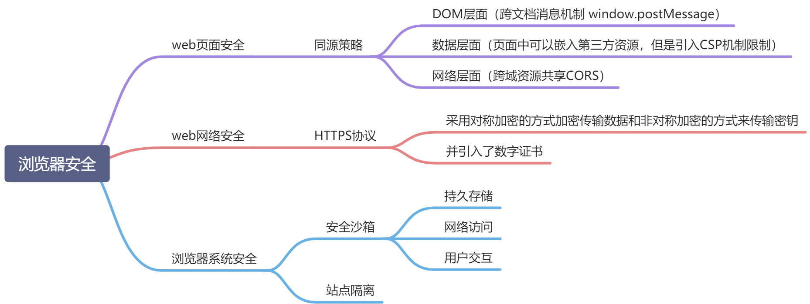

# 浏览器安全

> 可以分三大块：Web 页面安全、Web 网络安全、浏览器系统安全
> 

## Web 页面安全

> 主要表现为同源策略。两个 URL 的协议、域名和端口都相同，我们就称这两个 URL 同源
> 主要表现：
>
> 1. DOM 层面：限制不同源的 JavaScript 脚本对 DOM 对象读写
> 2. 数据层面：限制了不同源的站点读取当前站点的 Cookie、IndexDB、LocalStorage 等数据
> 3. 网络层面：限制了 http 请求对不同源的发送

### 安全后门

> 不过安全性和便利性是相互对立的，让不同的源之间绝对隔离，无疑是最安全的措施
> 但是 Web 项目难以开发和使用。因此浏览器做了权衡

1. 页面中可以引用第三方资源  
   如 `<script> 脚本` `<link> 样式表`
   - 问题： XSS 的安全问题  
     引入了 CSP （内容安全策略）来限制其自由程度  
     让服务器决定浏览器能够加载哪些资源
2. 跨文档消息机制  
   两个不同源的 DOM 是不能相互操纵的，浏览器中又引入了跨文档消息机制，可以通过 window.postMessage 的 JavaScript 接口来和不同源的 DOM 进行通信
3. 跨域资源共享  
   跨域资源共享策略（CORS）

## Web 网络安全

> HTTP 的明文传输使得传输过程毫无安全性可言
> 在 TCP 和 HTTP 之间插入一个安全层，所有经过安全层的数据都会被加密或者解密

### HTTPS 加密解密过程

> 在传输数据阶段依然使用对称加密，但是对称加密的密钥我们采用非对称加密来传输

<!-- 1. 首先浏览器向服务器发送对称加密套件列表、非对称加密套件列表和随机数 client-random。
2. 服务器保存随机数 client-random，选择对称加密和非对称加密的套件，然后生成随机数 service-random，向浏览器发送选择的加密套件、service-random 和公钥。
3. 浏览器保存公钥，并生成随机数 pre-master，然后利用公钥对 pre-master 加密，并向服务器发送加密后的数据。
4. 最后服务器拿出自己的私钥，解密出 pre-master 数据，并返回确认消息。 -->

<!-- 1. 客户端发起 HTTPS 请求
2. 服务器返回 SSL/TLS 证书
3. 客户端会验证 CA 证书。有没有过期
4. 没有过期的话，客户端会生成一个秘钥，并使用服务器的公钥进行加密。
5. 客户端会把这个秘钥发送给服务器。只有服务器的私钥才能解密
6. 服务器使用自己的私钥解密客户端发送的会话密钥，得到对称加密密钥（会话密钥）。
7. 接下来的传输都会用对称加密创数 -->

1. 客户端发起 HTTPS 请求 发送对称加密和非对称加密的加密套件列表、客户端随机数
2. 服务器选择加密套件，并发送服务器的随机数、CA 证书、公钥
3. 客户端验证证书有效期
4. 客户端生成预主密钥，使用服务器的公钥以及选择的非对称加密算法进行加密，发送给服务器
5. 服务器用私钥解密预主密钥。（不需要发送回客户端确认，因为服务器知道加密套件，以及随机数，只需要解出预主密钥就可以）
6. 使用客户端随机数、服务器随机数、预主密钥结合对称加密。生成最终的对称加密密钥
7. 对称加密传输数据

## 浏览器系统安全

### 安全沙箱

> 利用操作系统提供的安全技术

### 站点隔离

> 会将不同源的 iframe 分配到不同的渲染进程中
