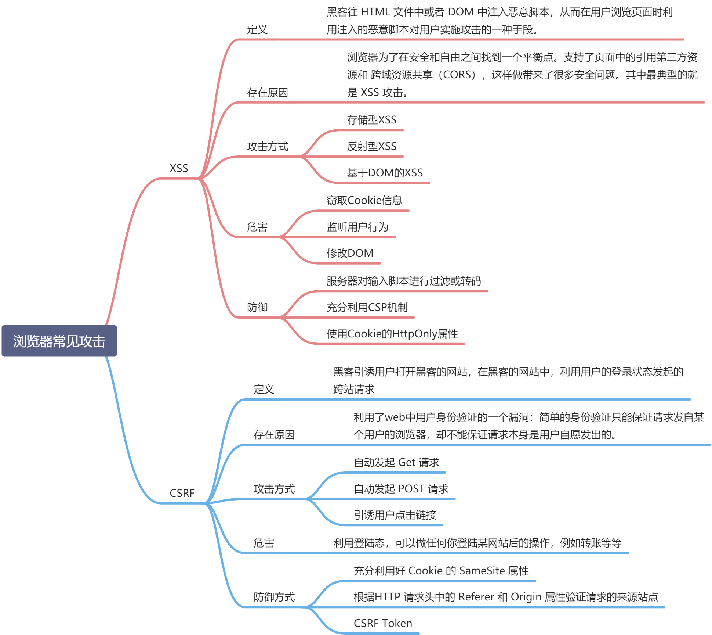

# 浏览器攻击

常见的浏览器攻击有以下几种：

- XSS（跨站脚本攻击）
- CSRF（跨站请求伪造）
- 点击劫持
- 中间人攻击
- SQL 注入攻击
- 文件上传漏洞

## XSS（跨站脚本攻击）

> 含义：XSS 攻击是指黑客往 HTML 文件中或者 DOM 中注入恶意脚本，从而在用户浏览页面时利用注入的恶意脚本对用户实施攻击的一种手段

### 存在原因

1. 浏览器为了在安全和自由之间找到一个平衡点。支持了 `页面中的引用第三方资源` 和 `跨域资源共享（CORS）`
2. 利用了浏览器对于从服务器所获取的内容的信任

### 攻击方式

1. 存储型 XSS 攻击( server 端)

   > 常见于带有用户保存数据的网站功能，如论坛发帖，商品评论
   > 步骤：

   1. 黑客将恶意代码提交到网站的数据库
   2. 用户访问这个页面，服务器会把这段恶意代码返回解析并执行
   3. 窃取用户数据

2. 反射型 XSS 攻击( server 端)
   > 常见于通过 URL 传递参数的功能，如网站搜索、跳转等
   > 步骤：
   1. 黑客构造出包含恶意代码的 URL
   2. 服务端将恶意代码从 URL 中取出，拼接在 HTML 中返回给浏览器
   3. 用户解析时也会把恶意代码解析
   4. 窃取用户数据，冒充用户的行为
3. 基于 DOM 的 XSS 攻击
   > 在 Web 资源传输过程或者在用户使用页面的过程中修改 Web 页面的数据。

### 防御

1. 服务器对输入脚本进行过滤或转码
2. 防止 Cookie 被盗用，使用 HttpOnly 属性
3. 利用 CSP。即 Content-Security-Policy

   1. 限制资源加载。  
      通过` default-src、script-src、style-src` 等指令，规定浏览器可以从哪些源加载资源
   2. 禁止执行内联脚本和未授权的脚本
      通过 `script-src 'self'`
   3. 提供了上报机制
      通过 `report-uri` 指令。测到 CSP 违规时可以报告给指定的服务器端 URL。

4. 输入验证

## CSRF（跨站请求伪造）

> CSRF 攻击就是利用了用户的登录状态，并通过第三方的站点来做一些坏事
> 即黑客伪造漏洞站点获取用户的登录态。即伪造成用户发送合法请求，如转账

### 防御

1. SameSite Cookie 属性  
   设置 Cookie 的 SameSite 属性为 Strict 或 Lax，限制 Cookie 仅在同站请求中发送
2. CSRF Token 验证  
   服务器会植入一个 token 验证，用户请求需要带上 Token。否则无法验证通过
3. 验证请求的来源站点(同源检测)  
   Referer 和 Origin 属性

## CSRF 和 XSS 的区别

1. CSRF 需要伪造获得用户的登录态，XSS 不需要
2. CSRF 是利用漏洞，去正常请求网站 A 的 api。而 XSS 是注入恶意代码，恶意篡改网站 A 的内容。
