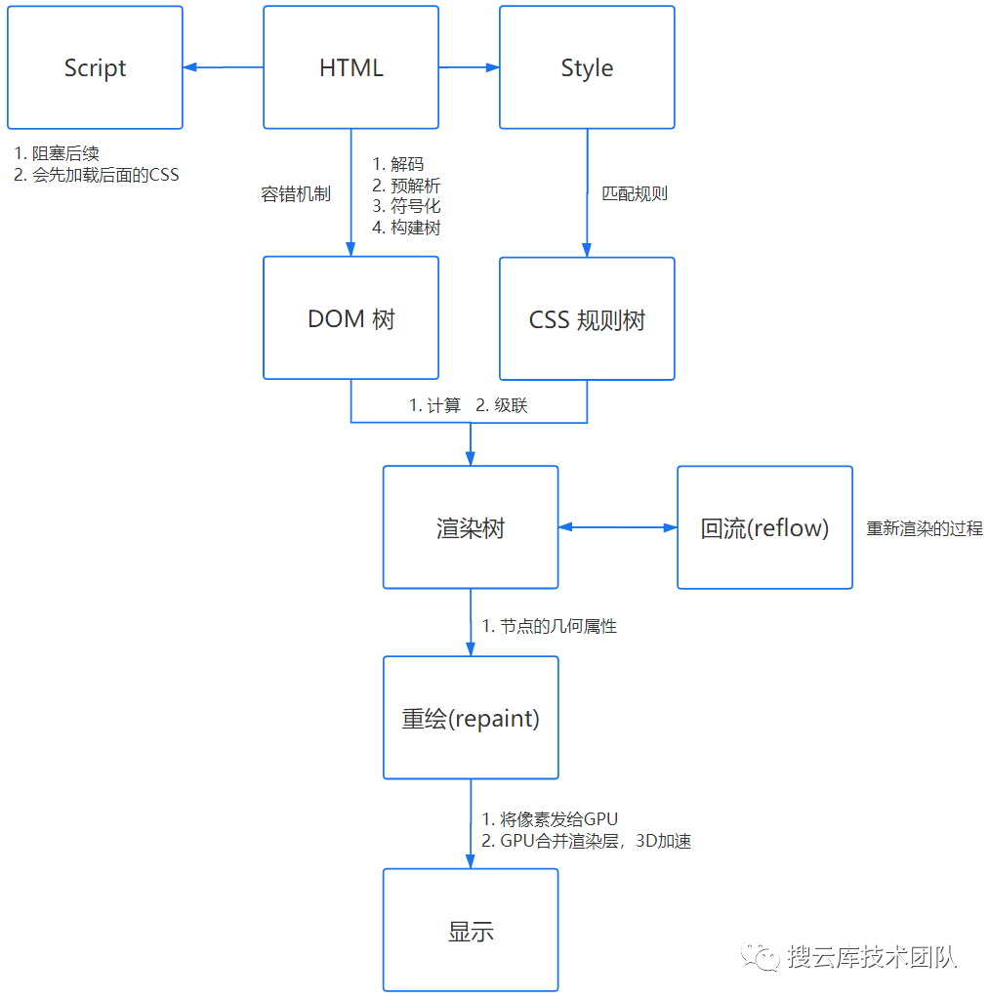

# 浏览器渲染

## 浏览器多进程

### 多进程的优缺点

1. 优点
   1. 稳定性，一个页面崩溃不会影响到其他页面，因为使用了不同渲染进程
   2. 安全性和沙箱处理，浏览器可以从某些功能中沙漏某些进程。例如，Chrome 浏览器限制了处理诸如渲染器进程之类的任意用户输入的进程的任意文件访问。
2. 缺点
   1. 更高的资源占用。
   2. 更复杂的体系架构。各模块耦合性太高

### 进程分类

> 主要包括以下几个进程：

1. 浏览器进程(主进程)
   界面显示、存储、交互等
2. 渲染进程

   > Chrome 浏览器会为每个 tab 标签创建一个渲染进程。如果存在两个 Tab 属于同源的话，那么会复用渲染进程。
   > 又细分为六大线程

   1. GUI 渲染线程
      负责渲染浏览器界面，解析 HTML，CSS，构建 DOM 树和 RenderObject 树，布局和绘制等，
   2. js 引擎线程
      解析 Javascript 脚本，运行代码
   3. 事件触发线程
      用来控制事件循环
   4. 定时触发线程
      定时计数器线程。  
      **📢 注意**：因为 JavaScript 引擎是单线程的, 如果处于阻塞线程状态就会影响记计时的准确
      计时完毕后，会把回调函数放进 JS 线程等待执行
   5. 异步 http 请求线程
      负责处理网络请求。请求完成后，回调函数会放进 js 线程等待执行
   6. 合成线程
   7. I/O 线程
      用来和其他进程进行通信

3. GPU 进程
   3D 渲染
4. 网络进程
   负责页面的网络资源加载
5. 插件进程
   插件运行。因为插件容易崩溃，独立了一个插件进程

## 页面渲染过程

> 大致分 6 步

1. 解析 HTML，构建 DOM 树
2. 解析 CSS ，生成 CSS 规则树
3. 合并 DOM 树和 CSS 规则树，生成 render 树
4. 布局 render 树（ Layout / reflow ），负责各元素尺寸、位置的计算 `涉及回流`
5. 绘制 render 树（ paint ），绘制页面像素信息 `涉及重绘`
6. 渲染

### 解析 HTML 生成 DOM 树

1. 是一个深度遍历过程：当前节点的所有子节点都构建好后才会去构建当前节点的下一个兄弟节点
2. 由于 js 可以操作 dom。解析到 Javascript 脚本时会停止对 dom 的解析

### 解析 CSS 生成 CSS 规则树

1. 是和 DOM 树解析同步执行的
2. 将 CSS 文本转换为浏览器可以理解的结构，即 CSSOM 树

### 合并 DOM 树和 CSS 规则树，生成 render 树

1. 计算出 DOM 树中每个节点的具体样式，需要有继承等规则
2. 最终输出的内容是每个 DOM 节点的样式，即 render 树

### 布局 render 树

1. 遍历 DOM 树中的所有节点，计算出每一个元素的位置和大小
2. 输出的结果最终为`box盒模型`
3. 过程涉及回流

<!-- ### 分层

1. 为了更方便的实现页面中的复杂的效果，如 3D 变换、页面滚动等，
2. 即将多个图层叠加在一起构成最终的页面图像。 -->

### 绘制 render 树

1. 将上一步计算出的布局树绘制到页面中
2. 过程涉及重绘

## 问题

1. GUI 渲染线程与 JS 引擎线程是互斥的，当 JS 引擎执行时 GUI 线程会被挂起
2. 为什么说 js 是单线程，而不是多线程
   1. 假设存在两个线程同时操作一个 DOM，一个负责修改一个负责删除，就会导致 UI 冲突
3. 渲染阻塞资源(CSS)
   1. CSS 是和 DOM 数构建同步执行的，
   2. CSS 需要完整的构建，如 DOM 先解析完成了，也必须等 CSS 解析完成后才能到下一阶段
   3. 例子：假设前面字体设置 16px，后面又设置了 14px，所以如果不把整个 CSS 树构建完整，是不准确的
4. CSS 会阻塞 JS 的执行，但不会阻塞 JS 的解析，JS 会阻塞后面 DOM 的解析
   1. JS 依赖 CSS 样式，而它还没有被下载和构建，浏览器就会延迟脚本的执行
   2. 解决办法：CSS 资源需排在 JS 资源前面，JS 应该放在 HTML 底部
   3. Javascript 脚本使用 defer，async 改变阻塞方式
5. CSS 的阻塞情况
   1. css 加载不会阻塞 DOM 树的解析
   2. css 加载会阻塞 DOM 树的渲染
   3. css 加载会阻塞后面 js 语句的执行
6. 渲染进程中会参与 JS 执行的线程
   1. JS 引擎线程
   2. 事件触发线程
   3. 定时器触发线程
   4. HTTP 异步请求线程
