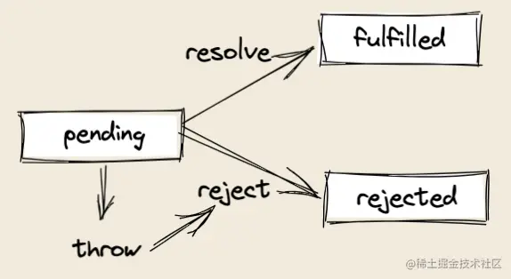

# leetcode

- [3.无重复字符的最长子串](../leetcode/3.js)
- [206.反转链表](../leetcode/206.js)
- [215.数组中的第 K 个最大元素](../leetcode/215.js)
  - 涉及快排、堆排序
-

# 其他

- 数组扁平化，去重，排序
  - [数组扁平化-7 种方法](../coding/flat.js)
- Pick 类型体操
- Promise
  - 
  - [promise + promise.all](../coding/promise.js)
- 数组求交集
- 数组右移 K 位
- 数组的相关方法梳理
  > https://blog.csdn.net/qq_39200185/article/details/121015316
- 排序

#

- var obj = {a: {b: {c: 2}}}; console.log(get(obj, 'a.b.c')); // 输出 2

  ```js
  var obj = { a: { b: { c: 2 } } }

  function get(obj, path) {
    // let strArr = path.split('.'),
    //   objNow = obj
    // for (i = 0; i < strArr.length; i++) {
    //   objNow = objNow[strArr[i]]
    //   if (i === strArr.length - 1) return objNow
    // }
    return path.split('.').reduce(function (acc, part) {
      return acc[part]
    }, obj)
  }
  console.log(get(obj, 'a.b.c')) // 输出 2
  ```

- console.log(fn([1, 2, 3, 4, 5], 2)) //结果为[[1,2],[3,4],[5]]

  ```js
  // NOTE:关键在这个i+=num，这样就是每隔num进行迭代
  function fn(arr, num) {
    if (arr.length < num) return arr
    const result = []
    for (let i = 0; i < arr.length; i += num) {
      result.push(arr.slice(i, i + num))
    }
    return result
  }
  console.log(fn([1, 2, 3, 4, 5], 2)) //结果为[[1,2],[3,4],[5]]
  ```

- 计算乘积除以当前项 //传参 [1,2,3,4] //输出 [24,12,8,6]
  ```js
  function Area(arr) {
    let area = arr.reduce((pre, cur) => {
      return pre * cur
    }, 1)
    return arr.map((item) => area / item)
  }
  ```
