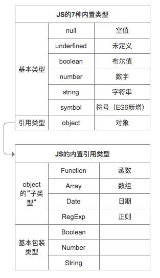

## js 类型

> https://segmentfault.com/a/1190000022471161

js 共 7 种类型分两大类(6 种基本类型和 1 种引用类型)：  
基本数据类型：string、number、boolean、null、undefined、symbol  
引用数据类型：Object（Funcation、Date、array、RegExp）或者认为除了基本类型以外都是引用类型


存放地址
基本数据类型存放在栈内存中，因为：占用空间小，大小固定。  
！！tips：闭包中的基本数据类型变量不保存在栈内存中，而是保存在堆内存中  
引用数据类型指针存放在栈内存，数据存在堆内存中，这个指针会指向堆内存的地址。因为：占据空间大、大小不固定

### typeOf

```js
// 基本类型
typeof 1 // 'number'
typeof '1' // 'string'
typeof undefined // 'undefined'
typeof true // 'boolean'
typeof Symbol() // 'symbol'
typeof b // b 没有声明，但是还会显示 undefined

typeof null // 'object'   =>js 历史悠久的 bug
```

```js
// 引用类型
Object.prototype.toString.call(22) //"[object Number]"

Object.prototype.toString.call('22') //"[object String]"

Object.prototype.toString.call(null) //"[object Null]"

Object.prototype.toString.call(undefined) //"[object Undefined]"
Object.prototype.toString.call(a) //"[object Undefined]"

Object.prototype.toString.call(true) //"[object Boolean]"

Object.prototype.toString.call({ a: 1 }) //"[object Object]"
```

### 为什么 0.1+0.2 不等于 0.3

> https://www.javascriptc.com/books/nodejs-roadmap/javascript/floating-point-number-0.1-0.2.html
> IEEE 754 是 IEEE 二进制浮点数算术标准的简称

本质二进制模拟十进制进行计算时 的精度问题
计算机底层存储都是基于二进制的，需要事先由十进制转换为二进制存储与运算，这整个转换过程中，类似于 0.1、0.2 这样的数是无穷尽的，无法用二进制数精确表示。JavaScript 采用的是 IEEE 754 双精确度标准，能够有效存储的位数为 52 位，所以就需要做舍入操作，这无可避免的会引起精度丢失。另外我们在 0.1 与 0.2 相加做对阶、求和、舍入过程中也会产生精度的丢失

正确来说：设置一个误差范围，即“机器精度”，该值定义在 ES6 的 Number.EPSILON 中

```js
console.log(Math.abs(0.1 + 0.2 - 0.3) <= Number.EPSILON)
```

### 总结：

1. js 共 7 种类型分两大类(6 种基本类型和 1 种引用类型)：
   基本数据类型：string、number、boolean、null、undefined、symbol  
   引用数据类型：Object（Funcation、Date、array、RegExp）或者认为除了基本类型以外都是引用类型
2. 基本数据类型存放在栈内存中，因为：占用空间小，大小固定；引用数据类型指针存放在栈内存，数据存在堆内存中，这个指针会指向堆内存的地址
3. 基本数据类型复制，改变其中一个，不会改变另一个，因为他们存在在不同的栈内存中；引用类型复制的话，改变其一的值，相应的另一个也会改变，因为他们用的是同一个引用指针
4. 基本数据类型的比较，是值的比较；引用数据类型是比较引用是否指向同一个对象
5. 基本数据类型变量大小固定，并且操作简单容易，所以把它们放入栈中存储；引用类型变量大小不固定，所以把它们分配给堆内存中，还需要在申请的时候确定大小。
6. typeof 基本类型都会显示对应的类型，但`typeof null` 会显示 object，这是 js 历史悠久的 bug；对于引用类型 可以通过`Object.prototype.toString.call` 来判断
7. 为什么 0.1+0.2 不等于 0.3？本质是二进制模拟十进制进行计算时的精度问题

## 栈内存和堆内存

> https://juejin.cn/post/6844903873992196110

以下是基本数据和引用数据类型在栈内存和堆内存的存储

```js
// 基本数据类型-栈内存
let a1 = 0
// 基本数据类型-栈内存
let a2 = 'this is string'
// 基本数据类型-栈内存
let a3 = null

// 对象的指针存放在栈内存中，指针指向的对象存放在堆内存中
let b = { m: 20 }
// 数组的指针存放在栈内存中，指针指向的数组存放在堆内存中
let c = [1, 2, 3]
```


## 值的可变性

## 比较

## Typeof

## this 指向

## 闭包

## 垃圾回收机制
