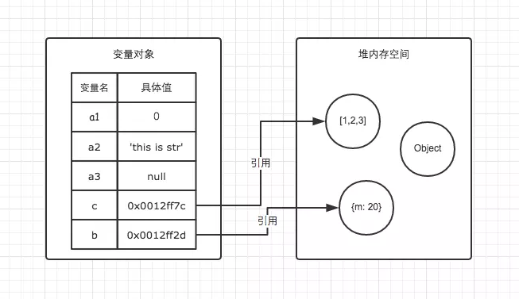

## js 类型

> https://segmentfault.com/a/1190000022471161

js 共 7 种类型分两大类(6 种基本类型和 1 种引用类型)：  
基本数据类型：string、number、boolean、null、undefined、symbol  
引用数据类型：Object（Funcation、Date、array、RegExp）或者认为除了基本类型以外都是引用类型


存放地址
基本数据类型存放在栈内存中，因为：占用空间小，大小固定。  
！！tips：闭包中的基本数据类型变量不保存在栈内存中，而是保存在堆内存中  
引用数据类型指针存放在栈内存，数据存在堆内存中，这个指针会指向堆内存的地址。因为：占据空间大、大小不固定

### typeOf

```js
// 基本类型
typeof 1 // 'number'
typeof '1' // 'string'
typeof undefined // 'undefined'
typeof true // 'boolean'
typeof Symbol() // 'symbol'
typeof b // b 没有声明，但是还会显示 undefined

typeof null // 'object'   =>js 历史悠久的 bug
```

```js
// 引用类型
Object.prototype.toString.call(22) //"[object Number]"

Object.prototype.toString.call('22') //"[object String]"

Object.prototype.toString.call(null) //"[object Null]"

Object.prototype.toString.call(undefined) //"[object Undefined]"
Object.prototype.toString.call(a) //"[object Undefined]"

Object.prototype.toString.call(true) //"[object Boolean]"

Object.prototype.toString.call({ a: 1 }) //"[object Object]"
```

### 为什么 0.1+0.2 不等于 0.3

> https://www.javascriptc.com/books/nodejs-roadmap/javascript/floating-point-number-0.1-0.2.html
> IEEE 754 是 IEEE 二进制浮点数算术标准的简称

本质二进制模拟十进制进行计算时 的精度问题
计算机底层存储都是基于二进制的，需要事先由十进制转换为二进制存储与运算，这整个转换过程中，类似于 0.1、0.2 这样的数是无穷尽的，无法用二进制数精确表示。JavaScript 采用的是 IEEE 754 双精确度标准，能够有效存储的位数为 52 位，所以就需要做舍入操作，这无可避免的会引起精度丢失。另外我们在 0.1 与 0.2 相加做对阶、求和、舍入过程中也会产生精度的丢失

正确来说：设置一个误差范围，即“机器精度”，该值定义在 ES6 的 Number.EPSILON 中

```js
console.log(Math.abs(0.1 + 0.2 - 0.3) <= Number.EPSILON)
```

### 总结：

1. js 共 7 种类型分两大类(6 种基本类型和 1 种引用类型)：
   基本数据类型：string、number、boolean、null、undefined、symbol  
   引用数据类型：Object（Funcation、Date、array、RegExp）或者认为除了基本类型以外都是引用类型
2. 基本数据类型存放在栈内存中，因为：占用空间小，大小固定；引用数据类型指针存放在栈内存，数据存在堆内存中，这个指针会指向堆内存的地址
3. 基本数据类型复制，改变其中一个，不会改变另一个，因为他们存在在不同的栈内存中；引用类型复制的话，改变其一的值，相应的另一个也会改变，因为他们用的是同一个引用指针
4. 基本数据类型的比较，是值的比较；引用数据类型是比较引用是否指向同一个对象
5. 基本数据类型变量大小固定，并且操作简单容易，所以把它们放入栈中存储；引用类型变量大小不固定，所以把它们分配给堆内存中，还需要在申请的时候确定大小。
6. typeof 基本类型都会显示对应的类型，但`typeof null` 会显示 object，这是 js 历史悠久的 bug，本质 null 是空对象指针，所以才显示 object；对于引用类型 可以通过`Object.prototype.toString.call` 来判断
7. 为什么 0.1+0.2 不等于 0.3？本质是二进制模拟十进制进行计算时的精度问题。因为 0.1、0.2 用二进制保存都是无穷尽的，相加肯定都有取舍操作，无可避免的尤精度丢失问题

## 栈内存和堆内存

> https://juejin.cn/post/6844903873992196110

以下是基本数据和引用数据类型在栈内存和堆内存的存储

```js
// 基本数据类型-栈内存
let a1 = 0
// 基本数据类型-栈内存
let a2 = 'this is string'
// 基本数据类型-栈内存
let a3 = null

// 对象的指针存放在栈内存中，指针指向的对象存放在堆内存中
let b = { m: 20 }
// 数组的指针存放在栈内存中，指针指向的数组存放在堆内存中
let c = [1, 2, 3]
```



## 比较(类型转化)

### == 和 ===区别，分别在什么情况使用

- ==等于操作符

  1. 两个都为简单类型，字符串和布尔值都会转换成数值，再比较
  2. 简单类型与引用类型比较，对象转化成其原始类型的值，再比较
  3. 两个都为引用类型，则比较它们是否指向同一个对象
  4. null 和 undefined 相等
  5. 存在 NaN 则返回 false

- ===全等操作符（严格相等）
  1. 基础类型：值相等，并且类型相等
  2. 引用类型：值相等并且引用类型

### 对象转原始类型

> 原理： 当对象参与计算时，会将其转化成基础类型进行计算

1. 转化过程中会调用内置函数，valueOf 和 toString，并且可以重写这两方法。所以有一个经典题：`如何让a == 1&&a == 2&& a==3相等`
2. 至于调用哪个方法，是看这个对象倾向于转换成什么
   1. 如果倾向于转换为 Number 类型就会优先调用 valueOf；
   2. 如果倾向于转换为 String 类型，就会调用 toString 了
   3. 重写 valueOf 和 toString 需要返回基础类型，否则会报错
3. 还内置了一个函数 Symbol.toPrimitive()方法，优先级别最高

```js
let a = {
  value: 1,
  valueOf() {
    return this.value++ // return {}会报错
  },
  toString() {
    return this.value++
  },
  [Symbol.toPrimitive]() {
    return this.value++
  }
}
if (a == 1 && a == 2 && a == 3) {
  console.log('true') // 输出true
}
```

## this 指向

> 函数执行的上下文环境，共分下面四种：默认绑定、隐式绑定、显示绑定、new 绑定。优先级从左往右依次递增

### 默认绑定

> 函数调用时无任何调用前缀的情景，即区别于其他的情况
> ！！默认指向全局 window 对象（非严格模式），严格模式环境中，默认绑定的 this 指向 undefined

### 隐式绑定

> 可以作为某个对象方法调用，这时候指向这个对象上一级。

```js
// 特殊情况
var o = {
  a: 10,
  b: {
    a: 12,
    fn: function () {
      console.log(this.a) //undefined
      console.log(this) //window
    }
  }
}
var j = o.b.fn
j() // this指向的是window，这里的大家需要记住，this永远指向的是最后调用它的对象
```

### new 绑定

> 通过构建函数 new 关键字生成一个实例对象，此时 this 指向这个实例对象

### 显示绑定

> 通过 call、apply、bind 显示的改变 this 指向。它的第一个参数就表示改变后的调用这个函数的对象

### 箭头函数

> 箭头函数不会受显示绑定影响，this 在创建时就已经确定，它继承自外围（定义位置的）上下文。

### 相关题目

```js
var name = 'window'

var person1 = {
  name: 'person1',
  foo1: function () {
    console.log(this.name)
  },
  foo2: () => console.log(this.name),
  foo3: function () {
    return function () {
      console.log(this.name)
    }
  },
  foo4: function () {
    return () => {
      console.log(this.name)
    }
  }
}

var person2 = { name: 'person2' }

person1.foo1() // person1 -> 隐式绑定
person1.foo1.call(person2) // person2 -> 显示绑定

person1.foo2() // window -> 箭头函数没有this指向，默认用父级作用域，父级作用域为window（person1对象没有块级作用域）
person1.foo2.call(person2) // window -> 同理于上，箭头函数导致用的window作用域，call失效

person1.foo3()() //window -> 返回的函数，在windows调用
person1.foo3.call(person2)() // window -> 返回的函数，在windows调用
person1.foo3().call(person2) // person2 -> 返回的函数，但是由于使用了call显示绑定

person1.foo4()() // person1(箭头函数不绑定this, 上层作用域this是person1)
person1.foo4.call(person2)() // person2 -> 先是给foo4这个方法绑定了一个this为person2  再次调用foo4()的时候为箭头函数 它的上层作用域被显示的绑定了一个person2
person1.foo4().call(person2) //person2 -> 因为先执行了foo4 返回的结果是一个箭头函数 箭头函数是不可以绑定this的 所以当调用这个箭头函数的时候 以及寻找上层作用域 (上层找到person1)
```

```js
var name = 'window'

function Person(name) {
  this.name = name
  this.foo1 = function () {
    console.log(this.name)
  }
  this.foo2 = () => {
    return console.log(this.name)
  }
  this.foo3 = function () {
    return function () {
      console.log(this.name)
    }
  }
  this.foo4 = function () {
    return () => {
      console.log(this.name)
    }
  }
}

// person1/person都是对象(实例instance)
var person1 = new Person('person1')
var person2 = new Person('person2')

// 面试题目:
person1.foo1() // person1
person1.foo1.call(person2) // person2

person1.foo2() // person1
person1.foo2.call(person2) //person1

person1.foo3()() // window
person1.foo3.call(person2)() // window
person1.foo3().call(person2) // person2

person1.foo4()() // person1
person1.foo4.call(person2)() // person2     ！！！！！（关注这两区别）链式调用到foo4时，foo4未执行，返回的是一个函数，通过call指针绑定到person2上面，再次执行的话。返回的是一个箭头函数，则会查找上层作用域，为上面绑定的call对象，即person2
person1.foo4().call(person2) // person1     ！！！！！（关注这两区别）链式调用到foo4时，foo4执行了，则会查找上层作用域。此时上层作用域为隐式调用的person1，后续的call绑定失效，返回最终结果person1
```

### apply、call、bind 的区别

- 三者都可以改变函数的 this 对象指向
- 三者第一个参数都是 this 要指向的对象，如果如果没有这个参数或参数为 undefined 或 null，则默认指向全局 window
- 三者都可以传参，但是 apply 是数组，而 call 是参数列表，且 apply 和 call 是一次性传入参数，而 bind 可以分为多次传入
- bind 是返回绑定 this 之后的函数，apply、call 则是立即执行

### new 操作符具体干了什么

1. 创建了一个新对象
2. 将新对象与构建函数通过原型链连接起来
3. 将构建函数中的 this 绑定到新建的对象 obj 上
4. 根据构建函数返回类型作判断，如果是原始值则被忽略，如果是返回对象，需要正常处理

```js
function myNew(Fun, ...args) {
  const obj = {}
  obj.__proto__ = Fun.prototype
  let result = obj.apply(Fun, args)
  // 4.根据返回值判断
  return result instanceof Object ? result : obj
}
```

## 闭包

> 闭包可以从内部函数访问外部函数的作用域，即外部保存的变量

### 闭包的形式

```js
function foo() {
  var name = '11'
  function bar() {
    console.log(name)
  }
  bar()
}
foo()
```

> 1. 返回一个函数，返回的函数引用了外部变量

```js
var name = '22'
function foo() {
  var name = '11'
  return function () {
    // 内部函数，一个闭包
    console.log(name) // 使用了父函数中声明的变量
  }
}
let bar = foo()
bar() // 这就是闭包，输出11
```

> 2. 作为函数参数传递，

```js
var a = 1
function foo() {
  var a = 2
  function baz() {
    console.log(a)
  }
  bar(baz)
}
function bar(fn) {
  // 这就是闭包
  fn()
}
// 输出2，而不是1
foo()
```

> 回调函数，在定时器中、事件监听、Ajax 请求等只要使用了回调，其实都是闭包

```js
// 定时器
setTimeout(function timeHandler(){
  console.log('timer');
}，100)

// 事件监听
$('#container').click(function(){
  console.log('DOM Listener');
})
```

> IIFE：IIFE(立即执行函数表达式)并不是一个典型的闭包，但它确实创建了一个闭包。

```js
var a = 2
;(function IIFE() {
  // 输出2
  console.log(a)
})()
```

### 经典题目

因为 js 是异步执行的，setTimeout 会在 for 循环结束后才会执行。并且由于 js 的作用域是在执行时确定的，不是在声明的时候，所以 setTimeout 中的 i 都是循环结束后的 i 值，也就是 6

```js
for (var i = 1; i <= 5; i++) {
  console.log(i) // 1 2 3 4 5
  setTimeout(function timer() {
    console.log(i) // 6 6 6 6 6
  }, i * 1000)
}
```

修改方法：

1. 引入`let`块级作用域的概念，这样就会在每次保存作用域了
2. 使用闭包

```js
for (var i = 1; i <= 5; i++) {
  ;(function (index) {
    setTimeout(function timer() {
      console.log(index)
    }, index * 1000)
  })(i)
}
```

## 执行上下文和执行栈

### 执行上下文

总结：

1. 执行上下文共分三种，分别为全局执行上下文（window，js 程序执行即有）、函数执行上下文（函数被调用就有）、eval 执行上下文。
   
2. 执行上下文的生命周期包括三个阶段：创建阶段 → 执行阶段 → 回收阶段
   1. 创建阶段
      1. 确定 this 的值，也被称为 This Binding
      2. 创建词法环境（分两部分：全局环境、函数环境）
         1. 全局环境：是一个没有外部环境的词法环境，其外部环境引用为 null，有一个全局对象，this 的值指向这个全局对象
         2. 函数环境：用户在函数中定义的变量被存储在环境记录中，包含了 arguments 对象，外部环境的引用可以是全局环境，也可以是包含内部函数的外部函数环境
      3. 创建变量环境（即词法作用域。分三种：全局作用域、函数作用域、块级作用域）
         1. 区别与上面的是有个块级作用域，即 `let` 和 `const` 创建的变量。这两在创建的时候并不会被默认赋值，但`var`创建的变量会在创建的时候默认赋值 undefined，这就是变量提升的实际原因。且`var`声明的变量不会创建块级作用域，默认是在全局作用域
         2. 
   2. 执行阶段
      1. 执行变量赋值、代码执行
      2. 如果 Javascript 引擎在源代码中声明的实际位置找不到变量的值，那么将为其分配 undefined 值
   3. 回收阶段
      1. 执行上下文出栈等待虚拟机回收执行上下文
3. 

### 执行栈

总结：

1. 也叫调用栈，具有先进后出的性质，用于存储在代码执行期间创建的所有执行上下文
2. 当 js 引擎开始执行第一行脚本代码的时候，就会创建一个全局执行上下文然后将它压到执行栈中。每当碰到一个函数，就会创建一个函数执行上下文，并将其压入栈中
3. 当上下文读取完毕后，引擎会执行位于栈顶的上下文，当上下文执行完毕后，对应的执行上下文就会被弹出。直至最后一个上下文执行完毕
   

### 作用域

> 也就是上面所说的`执行上下文`中的`变量环境`。分三种：全局作用域、函数作用域、块级作用域

- 作用域提升
  > 是 js 编译时的一个行为，当代码被编译时，js 引擎会把所有变量和函数都提升到当前作用域顶部。就会导致变量在声明前报错也不会报错

### 作用域链

> 当 js 引擎使用一个变量时，会先在当前作用域时查找，如未找到，会继续查找上层作用域，直至找到作用域顶层。如还未找到，就会报错（严格模式）


## 垃圾回收机制

？
