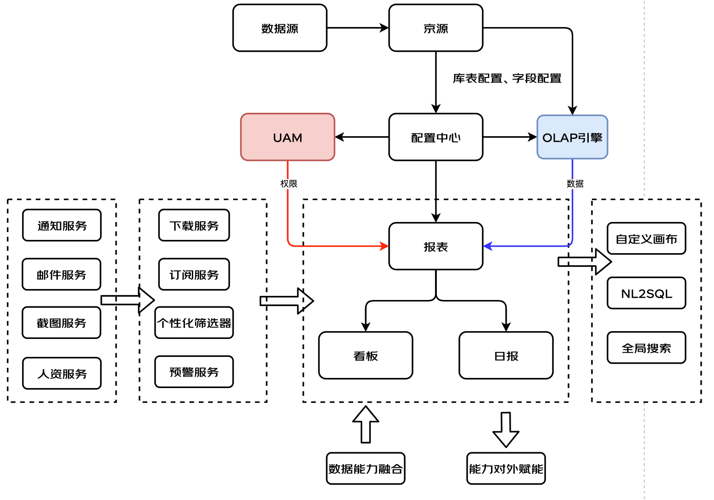

> 1. 需要吃透项目，并提供真正有技术难点的问题，最好有几个，而且这几个难点有关联，这样能很好的引导
>    如：乾坤的话，需要知道他的原理，以及多个微前端款姐的优劣势分析

工作经历

# 项目

## 京数通

- 介绍：通过对京准通系统海量广告业务数据的加工和呈现，为用户提供 PC 端的数据分析、数据监控等服务，是一站式 Saas 化的数据可视化系统。主要面向用户为广告运营、数据分析师、财务、老板、数据算法模型产研等，日常 UV300+，大促 UV500+
- 
- 技术栈：Vue3 + Vite + AntdV + TypeScript + Sass + qiankun + Jest + Echarts
- 主要工作：（写进去要会说）
  - 1、参与从零到一项目 Sass 化重构。包括负责开发 30+个页面以及抽离 40+公共及业务组件。
  - 2、
- 重点：
  难点：
  技术挑战：
  1. 中国式日报（复杂报表） ---->
  2. 截图服务（Node 项目）
  3.

共支持的需求：

项目名称：京数通
技术栈：Vue3 + TypeScript + Vite + Less + Antdv + qiankun + Vitest
项目描述：

- 是一款广告数据分析运营平台，通过对京准通系统（广告投放平台）海量广告业务数据的加工和呈现，为用户提供各种详细指标维度的数据分析、数据监控等服务，是一站式 Saas 化的数据可视化系统
- 参与从零到一的项目重构，负责及参与了 20+ 页面开发，抽离 10+ 公共及业务组件。个人主要负责中国式日报（复杂报表）、截图服务（Node 服务）、自定义看板、智能预警、ChatJst（chatgpt 版智能问答）等业务模块
- 负责组内系统的微前端架构改造，并在该项目中实现落地，期间共接入三个微应用
-
- 复杂报表？怎么复杂？如何生成的？还有什么优化方案
- ？？？
- 重难点？？？？
- 优化？？？性能提升？？

## 实时看板

- 简单介绍：实时看板是一个大促实时大屏项目，基于京东零售海量的广告数据，在大促期间对外提供实时广告数据的大屏展示。主要面向用户为零售广告团队、数据分析师、数据模型产研、老板等，日常 UV 20+，大促 UV 200+。
- 主要工作（详细介绍 2-3 分钟）：
  - 1、作为项目前端负责人，负责系统微前端架构改造、前端配置化升级等，可快速支持大促需求，前端人力缩减 90%
  - 2、主导系统的兼容性适配，完成 PC 端、移动端等多端适配
  - 3、负责 sse 协议升级、模拟滚数、同环比、公农历等
- 技术栈：React + Antd + SSE + qiankun
- 重点及难点：
  - ducc 配置化逻辑
  - SSE 实时数据
  - 模拟滚数逻辑
  - 自定义缩放、自适应
  - 各种兜底逻辑（错误重连、断网重连、自动断开链接、白名单）
- 技术挑战
  - 微前端架构改造
  - HTTP 升级为 SSE 协议，增加模拟滚数逻辑

总共支持的需求：

1. ** 微前端架构改造 **
2. 移动端兼容性适配
3. 昨日 Tab、同环比、公农历
4. ** HTTP 升级为 SSE 协议，增加模拟滚数逻辑 **

背景：需要一个实时大屏项目，
解决方案：调研 SSE 逻辑的使用，各种兜底逻辑处理（错误重连、断网重连、自动断开链接等），以及增加了前端模拟滚数
价值：带来了什么

项目名称：实时看板
技术栈：React + Antd + SSE + qiankun
项目描述：

- 实时看板是一个大促实时大屏项目，共分现金大盘和排行榜两大模块。基于京东零售海量的广告数据，在大促期间对外提供实时广告数据的大屏展示。
- 作为项目前端负责人，期间负责该系统的微前端架构改造、前端配置化升级、日常需求支持等，并在大促期间零事故发生。
- 负责项目底层交互的升级，主要分为与后端交互从 HTTP 升级为 SSE 技术、并增加前端模拟滚数能力（该升级在 2022Q4 获得个人绩效 A）
- 负责项目在 PC 端+移动端的兼容性适配升级，主要分为面向不同微前端主应用的宽度自适应、兼容在移动端的显示问题。

## 前端截图服务

前端截图服务
技术栈：Egg.js + puppeteer + async + ImageMagick
项目描述：

- 截图服务是一个独立的前端 Node 服务，通过接口调度后模拟登录目标系统并使用 puppeteer 调用浏览器访问目标 URL 页面进行截图操作，完成后以邮件的方式发送给用户。
- 作为项目负责人，从零到一独立设计和开发了该系统，并增加了接口错误拦截机制、错误重试机制、监控告警、日志等功能。
- 增加限流策略，系统 CPU 及内存使用率从 80%降低到 25%，解决服务会偶发超载的情况
- 增加截图优化策略，保证多个复杂表格的截图清晰度提高

## CRM 系统

- 介绍：
- 技术栈：Vue2 + TypeScript + ElementUI + Sass + qiankun + Echarts

项目名称：CRM 系统
技术栈：Vue2 + TypeScript + ElementUI + Sass + qiankun
项目描述：

- 是一款广告客户关系管理系统，具有商业智能和决策分析能力。依托京东零售广告大数据的优势，为运营提供全景广告主相关的多维数据分析能力、营销管理能力和目标管理能力。现已和京数通系统打通，实现数据分析、监控、客户关系管理、营销管理为一体化。
- 项目前端负责人，主要负责该项目的微前端架构改造，以及项目的迭代维护，主要模块有商机管理、客户管理、广告主挖掘、客户流转挖掘等
- 完成权限配置化打通，新团队接入或权限口径变更前端零代码开发，大幅减少开发成本。

# 其他

- Vue3 组件库
- 参与搭建脚手架框架

# 性能优化

1、版本更新提示

## 小技巧：

首先，说明需求和背景，让面试官明白你做的是个什么事情，为何是个难点，难在哪里？ —— 这很重要。
然后，说明解决方案，通过什么途径、什么方式、什么技术，来解决这些难点。注意，这里要多说一些技术名词，体现技术解决方案。
最后，说明解决以后的成果，带来了什么价值

项目难点尽量规模大一些。例如说一些技术方案的设计，这可以更加全面、完整的体现自己的技术能力

TODO：
列一下 CMR、京数通的需求支持，挑出重点和难点
